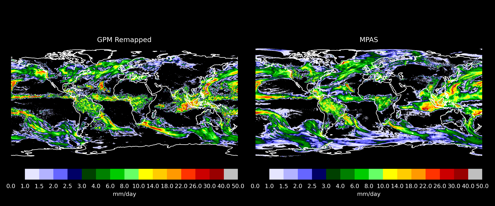
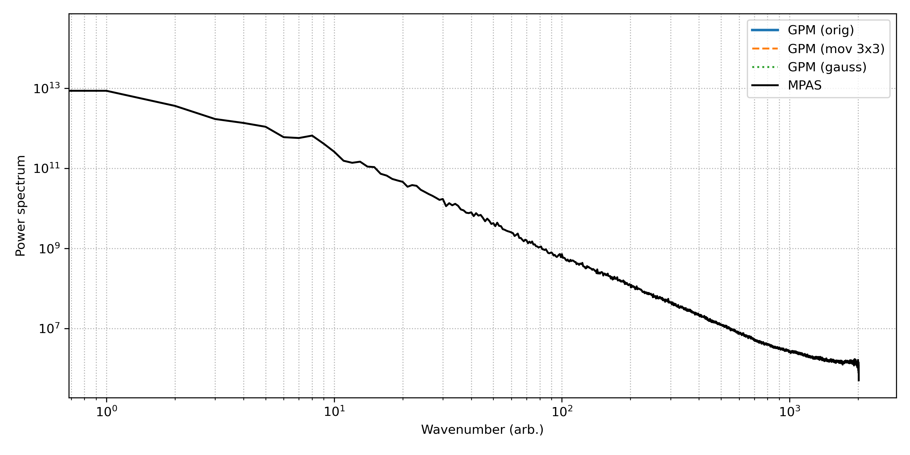

# Projeto de Comparação e Análise de Precipitação entre GPM e MONAN/MPAS

Este projeto realiza a comparação entre as estimativas de precipitação do satélite **GPM (IMERG)** e a simulação do modelo **MONAN/MPAS**, utilizando uma cadeia padronizada de processamento:

1. **Remapeamento** do GPM para a grade do MPAS
2. **Suavizações** do campo remapeado (média móvel e gaussiana)
3. **Comparações visuais** GPM × MPAS
4. **Análises espectrais** (potência e eficiência) para avaliar a resolução efetiva

---

## Objetivos

* Comparar diretamente os campos de precipitação (mm/dia) entre GPM e MPAS
* Avaliar o impacto do remapeamento em uma grade comum
* Aplicar suavizações para investigar mudanças no espectro
* Determinar a **resolução efetiva** do modelo por meio de análise espectral

---

## 🧭 **Resumo do Projeto MPAS\_PREC\_AVAL (até aqui)**

### 🎯 **Objetivo principal**

Comparar a precipitação simulada pelo modelo **MPAS** com a observada pelo **GPM** (IMERG) em termos de:

* Distribuição espacial
* Eficiência espectral
* Potência espectral

De forma automatizada, com geração de figuras comparativas, espectros e notebook.

---

## 🗂️ **Pipeline atual**

### 1. **Dados**

* **GPM** (IMERG 1h → remapeado para grade MPAS)
* **MPAS** (precipitação diária)

### 2. **Scripts envolvidos**

| Etapa             | Script        | Função                             |
| ----------------- | ------------- | ---------------------------------- |
| Regradeamento     | `regrid.py`   | Remapeia GPM → MPAS                |
| Suavização        | `smooth.py`   | Média móvel 3x3 e filtro gaussiano |
| Comparação direta | `compare.py`  | Painéis comparativos GPM × MPAS    |
| Espectro          | `spectral.py` | Potência e eficiência espectral    |
| Visualização      | `plot_map.py` | Mapas NetCDF com Cartopy           |
| CLI               | `cli.py`      | Interface única de execução        |

---

## 🤔 **Por que a suavização foi incluída?**

A suavização foi proposta para **investigar o efeito da resolução** e do "ruído de alta frequência" do GPM, porque:

* A resolução do GPM (0.1°) pode conter variações de alta frequência que o MPAS (10 km) não capta.
* A suavização ajudaria a ver como essas variações influenciam o espectro.

**Ou seja:**

> Comparamos o GPM original, suavizado com média móvel (MOV) e suavizado com Gauss (GAU) com o MPAS.

Isso está diretamente ligado ao cálculo de **eficiência espectral**:

$$
\text{Eficiência} = \frac{E_{\text{GPM}}(k)}{E_{\text{MPAS}}(k)}
$$

---

## 😵‍💫 **Mas o que deu errado?**

* O GPM contém **muitos NaNs** (como é esperado em campos reais de precipitação).
* Os métodos `uniform_filter` e `gaussian_filter` **não lidam com NaNs**, o que fez a suavização **propagar os NaNs**.
* Mesmo usando `rolling().mean()` do xarray, os NaNs **ainda dominam** e a suavização retorna campos quase vazios.
* Isso impacta diretamente o espectro: GPM suavizado (MOV) aparece como `nan` ou com valores absurdamente baixos.

---

## ✅ **Conclusão: manter ou remover a suavização?**

Depende do que tu quer demonstrar:

| Objetivo                                                              | Suavização é útil? |
| --------------------------------------------------------------------- | ------------------ |
| Avaliar se o MPAS representa bem a precipitação observada             | ❌ **Não**          |
| Estudar como diferentes níveis de suavização do GPM afetam o espectro | ✅ **Sim**          |
| Comparar diretamente o espectro bruto dos dois campos                 | ❌ **Não precisa**  |

---

## Estrutura de Diretórios

```
├── data_processed               # Arquivos NetCDF intermediários
├── figs                         # Figuras geradas
├── gpm.txt                      # Lista de arquivos GPM
├── mpas.txt                     # Lista de arquivos MPAS
├── README.md                    # Documentação detalhada
├── scripts/                  # Scripts Python organizados por função
│   ├── cli.py                # Ponto único de entrada via linha de comando
│   ├── common.py             # Utilitários e funções compartilhadas
│   ├── regrid.py             # Remapeamento GPM → MPAS
│   ├── smooth.py             # Suavizações (mov. 3x3 e gaussiana)
│   ├── compare.py            # Comparações visuais GPM × MPAS
│   ├── spectral.py           # Análises espectrais (potência, eficiência ou ambas)
│   └── environment.yml       # Definição do ambiente Conda
└── README.md
```

---

## Scripts e Funções

### `cli.py`

Interface de linha de comando para todo o projeto. Subcomandos disponíveis:

```bash
python -m scripts.cli regrid    --gpm GPM.nc4 --mpas mpas10km.nc4
python -m scripts.cli smooth    [--sigma 1.0]
python -m scripts.cli compare   --mpas mpas10km.nc4 [--style black|light]
python -m scripts.cli spectral  power|efficiency|all --mpas mpas10km.nc4
python -m scripts.cli run-all   --gpm GPM.nc4 --mpas mpas10km.nc4
```

---

### `regrid.py`

* **Função**: Reamostra os dados GPM (grade 0.1° lat/lon) para a grade do MPAS.
* **Saída**:

  * `data_processed/gpm_remap_to_mpas.nc`
  * `data_processed/weights_gpm_to_mpas.nc` (pesos `xesmf` reaproveitáveis)

---

### `smooth.py`

* **Função**: Aplica duas suavizações ao GPM remapeado:

  * Média móvel 3x3
  * Filtro gaussiano com σ ajustável (`--sigma`)
* **Saída**: `data_processed/gpm_smoothed.nc`

---

### `compare.py`

* **Função**: Gera painel comparando GPM (remapeado) e MPAS (precipitação diária média)
* **Saída**: `figs/comparacao_gpm_mpas_{style}.png`

---

### `spectral.py`

* **Função**: Executa análises espectrais:

  * `power`: espectros de potência
  * `efficiency`: eficiência espectral (razão GPM/MPAS)
  * `all`: ambas
* **Saídas**:

  * `figs/espectros_precipitacao.png`
  * `figs/eficiencia_espectral.png`

---

## Fluxo Completo

Para rodar todo o pipeline de uma vez:

```bash
python -m scripts.cli run-all --gpm /caminho/GPM.nc4 --mpas /caminho/mpas10km.nc4
```

O pipeline executa na ordem:

1. Remapeamento (`regrid`)
2. Suavizações (`smooth`)
3. Comparação visual (`compare`)
4. Análise espectral (`spectral all`)

---

## Interpretação Física

* **Alta frequência (número de onda alto)**: estruturas pequenas (chuvas localizadas)
* **Eficiência espectral > 1**: GPM tem mais energia nessa escala → MPAS filtra estruturas pequenas
* **Eficiência espectral ≈ 1**: representação similar
* **Eficiência espectral < 1**: MPAS com mais energia nessa escala

---

## Requisitos

Arquivo `environment.yml`:

```yaml
name: regrid_env
channels:
  - conda-forge
dependencies:
  - python=3.12
  - numpy
  - xarray
  - netcdf4
  - xesmf
  - esmpy
  - matplotlib
  - cartopy
  - scipy
```

Instalação:

```bash
conda env create -f scripts/environment.yml
conda activate regrid_env
```

---

## 🔁 Execução do Projeto

```

### Execução automática
Para rodar todas as etapas de forma automática (reamostragem + geração de figuras), execute o script abaixo:
```bash
python scripts/run_all.py
```

---

## Estrutura Esperada após Execução

```
.
├── data_processed/
│   ├── gpm_remap_to_mpas.nc
│   ├── gpm_smoothed.nc
│   └── weights_gpm_to_mpas.nc
├── figs/
│   ├── comparacao_gpm_mpas_black.png
│   ├── espectros_precipitacao.png
│   └── eficiencia_espectral.png
```

---

## Exemplos de Resultados

### Comparação GPM × MPAS



### Espectros de Potência



### Eficiência Espectral


---


